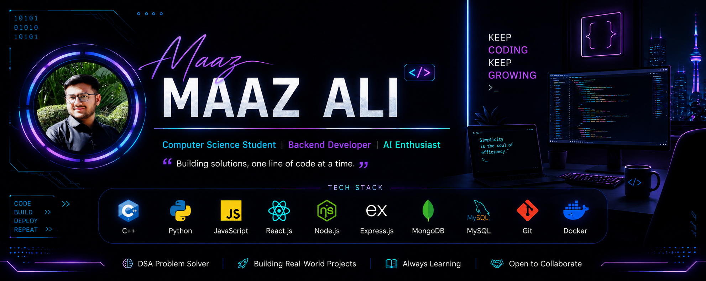

  

# 💫 About Me:
🔭 I’m currently working on Full-Stack Web Applications with Django & React  👯 I’m looking to collaborate on Open Source, Backend, and AI-powered projects  🤝 I’m looking for help with System Design, Cloud Technologies, and Machine Learning  🌱 I’m currently learning Django, REST APIs, Docker, AI/ML, and PostgreSQL  💬 Ask me about C++, Python, Django, React, SQL, and Data Structures & Algorithms  ⚡ Fun fact I love turning ideas into real-world software and continuously learning new technologies

## 🌐 Socials:
   

#  Tech Stack:
                                
#  GitHub Stats:
 
 

# Activity
<picture data-importer="pacman">
  <source media="(prefers-color-scheme: dark)" srcset="https://raw.githubusercontent.com/MaazAli-27/MaazAli-27/pacman-output/pacman-contribution-graph-dark.svg?game=pacman">
  <source media="(prefers-color-scheme: light)" srcset="https://raw.githubusercontent.com/MaazAli-27/MaazAli-27/pacman-output/pacman-contribution-graph.svg?game=pacman">
  
</picture>

###

###

###

### ✍️ Random Dev Quote

### 🔝 Top Contributed Repo
## 📌 Top Repositories

<table>
  <tr>
    <td width="50%">
      <h3><a href="https://github.com/MaazAli-27/Resturant-ordering-system">🍽️ Savoria — Restaurant Ordering System</a></h3>
      Full-stack restaurant platform (customer app, admin dashboard, backend API) with real-time order tracking via Socket.io, Stripe payments, table reservations, JWT auth, and PDF invoice generation.
        
      <code>React</code> <code>Node.js</code> <code>Express</code> <code>MongoDB</code> <code>Stripe</code> <code>Socket.io</code>
    </td>
    <td width="50%">
      <h3><a href="https://github.com/MaazAli-27/school-management-system">🎓 School Management System</a></h3>
      Role-based desktop app with dedicated Admin, Teacher, and Student dashboards for attendance, class scheduling, exam management, and results.
        
      <code>C++</code> <code>Qt Framework</code> <code>MySQL</code>
    </td>
  </tr>
  <tr>
    <td width="50%">
      <h3><a href="https://github.com/sarimkhan4/Local_Service_Marketplace">🛠️ Local Service Marketplace</a></h3>
      Full-stack service booking platform with RBAC, scheduling, payments, and reviews — contributed to the NestJS backend and Angular frontend.
        
      <code>Angular</code> <code>NestJS</code> <code>TypeORM</code> <code>MySQL</code>
    </td>
    <td width="50%">
      <h3><a href="https://github.com/MaazAli-27/Maze-Game">🧩 Maze Solver & Game (BFS Pathfinding)</a></h3>
      20×20 console-based maze with manual gameplay and an automatic shortest-path solver using Breadth-First Search graph traversal.
        
      <code>C++</code> <code>BFS</code> <code>Graph Algorithms</code>
    </td>
  </tr>
  <tr>
    <td width="50%">
      <h3><a href="https://github.com/MaazAli-27/Advanced-rock-paper-scissor">⚡ Neon Clash: RPSLS Super Ultra</a></h3>
      Cyberpunk arcade take on Rock-Paper-Scissors-Lizard-Spock with an HP/combo system, a Markov-chain predictive AI opponent, Gemini-powered taunts, and Firebase cloud stats.
        
      <code>JavaScript</code> <code>Tailwind CSS</code> <code>Firebase</code> <code>Gemini API</code>
    </td>
    <td width="50%">
      <h3><a href="https://github.com/MaazAli-27/SNAKE-AND-LADDER-GAME">🎲 Snake & Ladder Game</a></h3>
      Classic Snake and Ladder built in C with Raylib for graphics rendering.
        
      <code>C</code> <code>Raylib</code>
    </td>
  </tr>
  <tr>
    <td width="50%">
      <h3><a href="https://github.com/MaazAli-27/Tic-Tac-Toe-">❌⭕ Tic-Tac-Toe</a></h3>
      Classic two-player Tic-Tac-Toe implementation.
    </td>
    <td width="50%"></td>
  </tr>
</table>

---

<!-- Proudly created with GPRM ( https://gprm.itsvg.in ) -->
